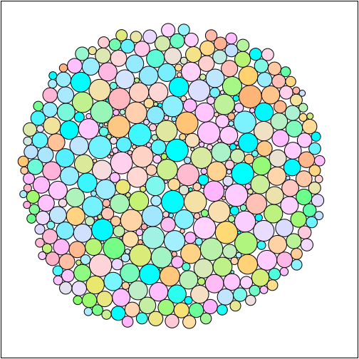

# affineplane-circlepack

[](https://www.npmjs.com/package/affineplane-circlepack)
[](#license)

Deterministic and order-preserving 2D circle packing algorithm for data visualization. Try the [demo](https://demos.akselipalen.com/circlepack/).



## Install

Install with [npm](https://www.npmjs.com/package/affineplane-circlepack) or [yarn](https://yarnpkg.com/en/package/affineplane-circlepack):

```
$ npm install affineplane-circlepack
$ yarn add affineplane-circlepack
```


## Usage

The basic usage is simple:

```
const pack = require('affineplane-circlepack')

const circles = [
  { x: 1, y: 0, r: 1 },
  { x: 2, y: 4, r: 2 },
  { x: 1, y: 5, r: 2 },
  ...
]

const packed = pack(circles)
// packed is an array that contains the same circles with x and y adjusted.
```

Asynchronic runs are good for packing large sets of circles in a non-blocking way:

```
pack(circles, (batch) => {
  console.log('A batch of packed circles fresh out of the oven.', batch)
}, () => {
  console.log('All packed.')
})
```


## Contribute

Pull requests and [bug reports](https://github.com/axelpale/affineplane-circlepack/issues) are highly appreciated. Please test your contribution with the following scripts:

Run test suite:

    $ npm run test

Run only linter:

    $ npm run lint


## See also

This library uses some tools from [affineplane](https://axelpale.github.io/affineplane/) geometry library.


## License

[MIT](LICENSE)
